# slurm-scheduler-lab

Test Slurm priority and backfill policy against a job trace **before** you put it
on a live controller.

Changing `PriorityWeightFairshare` on a production cluster is a slow, expensive
experiment: the feedback loop is days long, the blast radius is everyone's
queue, and the only rollback signal is people complaining. This runs the same
policy against a few hundred jobs in about a second (a long, busy trace takes
longer; see [the cost table](#point-it-at-your-own-cluster)).

```bash
pip install -e .
schedlab --compare-backfill --jobs 300 --seed 5
```

Excerpt of that command's output (the full report also lists makespan, p95,
GPU utilization, Definition C fragmentation, per-account waits, and the
backfill-cycle statistics described below):

```
300 jobs · 16 nodes × 8 CPU / 2 GPU
trace: synthetic (seed=5)
model: conservative backfill · fairshare fair_tree · PriorityCalcPeriod 5 min

backfill OFF
  cpu utilization             72.3 %
  mean wait                 1896.7 min
  median wait               2270.4 min
  mean bounded slowdown     367.90

backfill ON
  cpu utilization             83.0 %
  mean wait                  396.1 min
  median wait                133.7 min
  mean bounded slowdown      42.03
```

Those are synthetic numbers from the simulator, not from a cluster. To get your
own, point it at your real config and a 30-day `sacct` trace — one command, no
controller touched:

```bash
schedlab --slurm-conf /etc/slurm/slurm.conf --sacct trace.txt --nodes 64 --cpus 32 --gpus 4
```

Full recipe under [Point it at your own cluster](#point-it-at-your-own-cluster).

---

## What it models



<sub>The EASY picture: job B starts ahead of higher-priority work because it provably finishes before the reservation. Job C does not, so it waits. The default conservative mode applies the same test against every planned job, not just the first. The figure's numbers are EASY's, from `schedlab --compare-backfill --jobs 300 --seed 5 --backfill-mode easy`; until this release they were 0.1.0's and the command it named did not give them.</sub>

**Multifactor priority** — the formula from `priority/multifactor`:

```
priority = weight_age       × age_factor
         + weight_fairshare × fairshare_factor
         + weight_jobsize   × jobsize_factor
         + weight_partition × partition_factor
         + weight_qos       × qos_factor
         - nice
```

Every factor is normalised to `[0, 1]`, so the weights alone decide what the
queue optimises for. Two factors have no source from the command line and
are 0 there, whatever their weight. The partition factor comes from a
partition's `PriorityJobFactor`, and `PartitionName` lines are not parsed
(the library takes a table: `simulate(partitions=...)`). The QOS factor
comes from QOS priorities in the accounting database, which an sacct trace
does not carry; synthetic and S0 traces set it. A config that sets
`PriorityWeightPartition`, or `PriorityWeightQOS` on an sacct trace, gets a
warning saying so. The job size factor is Slurm's: the job's share of the
nodes and its share of the CPUs, averaged (`set_priority_factors()`). For
whole-node jobs on identical nodes the two shares are equal, so every job
in the synthetic workload gets the same factor as under a CPU-only formula.
For an S0 gang of one-CPU pods the node share dominates.

**Fairshare, both of Slurm's algorithms.** The default is **Fair Tree**,
because it is what an unconfigured controller runs, and it has been since
Slurm 19.05
([priority_multifactor](https://slurm.schedmd.com/priority_multifactor.html)).
A tool that predicts what your controller will do should default to what your
controller does. Fair Tree ranks accounts by Level Fairshare `LF = S / U` and
gives each `rank / N` ([fair_tree](https://slurm.schedmd.com/fair_tree.html)).
**Classic**, `F = 2^(-U/S)`, is what you get with `PriorityFlags=NO_FAIR_TREE`
([classic_fair_share](https://slurm.schedmd.com/classic_fair_share.html)).

On a flat account tree the two agree on *order*; they differ in *spacing*.
Fair Tree puts a full rank step between two accounts whose usage differs by
1%, and that can flip a decision other weights would otherwise win (pinned in
`test_fair_tree_turns_a_small_usage_gap_into_a_full_rank_step`). The Fair Tree
docs make the related point that, because it ranks every association,
`PriorityWeightFairshare` "can be usefully set to a much smaller value than
usual". The lab's demo weight of 10,000 predates Fair Tree support here and was
not retuned for it.

**Usage accrues on `PriorityCalcPeriod`, as it does in Slurm.** Every 5
simulated minutes (configurable), a tick decays recorded usage on
`PriorityDecayHalfLife`. It then charges each running job for the CPU-seconds
it ran since the last tick, and recomputes every pending job's priority. A job
that ends is charged its final partial period at once. Between ticks,
priorities are snapshots. This lag is modelled on purpose, because it is real:

- with Fair Tree, priorities see usage up to the last tick — up to one period stale;
- with classic, they see usage as it stood at the *start* of the last tick,
  before that tick's accrual: one period more. `_decay_thread()` computes
  each account's effective usage first and marks every user's stale; the
  same tick's priority loop then recomputes a user's from its account's
  (`_get_fairshare_priority()`, `_set_usage_efctv()`), and on this model's
  one-user accounts that is the account's start-of-tick value.

Both come from reading `priority_multifactor.c` and `fair_tree.c` at
[SchedMD/slurm@9f9da53](https://github.com/SchedMD/slurm/tree/9f9da53b4a7bc5b56062bc357f4f94e0d19c71cc).
The tests show a 1-minute vs 1-hour period flipping which job runs first, and
classic trailing Fair Tree by exactly one period. `--calc-period 0` switches
the lag off: priorities are refreshed at every event with a job pending,
which includes the periodic main pass, each backfill cycle and a requeued
job's begin time as well as submits and completions. (It used to refresh on
submits and completions only, so a timer-driven backfill cycle sorted by
stale priorities; `test_idealised_mode_refreshes_before_a_timer_only_backfill_cycle`
pins the fix.) That is an idealisation for comparison
that Slurm cannot run: it reads `PriorityCalcPeriod` in whole minutes,
rounding up (`0:30` is one minute), and rejects only 0. The CLI rounds a
fractional `--calc-period` up the same way and says so.

Slurm stores a job's priority as an integer of at least 1, and so does the
model: two jobs whose weighted sums differ by less than one can tie, and the
earlier submit then goes first.

`PriorityUsageResetPeriod` NONE, NOW, DAILY and WEEKLY are implemented.
DAILY and WEEKLY reset at local midnight and Sunday 00:00, as `_next_reset()`
does. An sacct trace fixes where its t=0 falls in the week from its earliest
`Submit` (the cluster's local time, as sacct prints it), and the header says
so. A synthetic or S0 trace has no calendar: t=0 is taken as Sunday 00:00,
with a warning. The calendar-month values need a calendar the simulator does
not have. The library (`PriorityEngine`) refuses them. The CLI, which reads
them from a slurm.conf, prints a warning and simulates NONE, as it does for
other config settings it cannot apply. `PriorityDecayHalfLife=0` without a
`PriorityUsageResetPeriod` line is refused, as slurmctld refuses it
(`read_config.c`: usage would only ever grow).

**Scheduling, two ways.** `--backfill-mode conservative` (the default) is the
shape of Slurm's `sched/backfill`
([sched_config](https://slurm.schedmd.com/sched_config.html)):

- a **main scheduler** runs on every submit and completion. It goes in strict
  priority order and stops at its first blocked job, testing at most
  `default_queue_depth + 1` jobs: `_schedule()` breaks on `job_depth++ >
  def_job_limit`. (Slurm removes the blocked job's partition *nodes* from
  the rest of the pass, and every partition here spans every node.) A full
  pass also runs every `sched_interval`. With `sched_interval=0` every pass
  is a full one. With `-1` there is no main scheduler at all, event passes
  included, and only backfill starts jobs;
- a **backfill cycle** runs every `bf_interval`. It plans each pending job,
  in priority order, into a **per-node** timeline, reserving whole nodes as
  Slurm does. It starts a job only if doing so moves no higher-priority job's
  planned start. The cycle stops after `bf_max_job_test` jobs. It does not
  reserve for jobs whose earliest start lies beyond `bf_window`. It quantises
  reservations outward to `bf_resolution`, and applies the per-user,
  per-partition and per-association limits (with both `bf_max_job_assoc` and
  `bf_max_job_user` set, the association cap wins, as in `backfill.c`).

`SchedulerParameters`, `SchedulerType` and `PriorityFlags` are read from your
slurm.conf, with defaults from slurm.conf(5) for Slurm 26.05. A setting that
would change what Slurm schedules but is not modelled is printed as a warning
rather than silently ignored. That covers unmodelled `PriorityFlags`,
`SchedulerParameters` and `PreemptParameters`, and `FairShareDampeningFactor`,
`PrioritySiteFactorPlugin`, `PriorityParameters`, `OverTimeLimit`,
`TopologyPlugin`, `SelectTypeParameters`, and `PartitionName` and `NodeName`
lines (`config._UNMODELLED_KEYS`). Keys with no scheduling effect, such as
`SlurmctldHost` or log levels, are ignored without a word. Each run reports
backfill-cycle statistics: cycles, jobs tested per cycle, and cycles that hit
`bf_max_job_test`.

`--compare-backfill` always runs its ON leg with backfill. A config that
disables it, by `SchedulerType=sched/builtin` or `bf_interval=-1`, is
overridden for that leg (with Slurm's default `bf_interval=30`), and a
warning says so. The OFF leg is the config as given.

`--backfill-mode easy` keeps the textbook model this project started with,
**EASY backfill** (Lifka, 1995). At every event it sorts the queue, starts what
fits, and reserves for the first job that does not fit at its *shadow time* —
the earliest moment enough resources free up, assuming every running job uses
its full time limit. It then lets lower-priority jobs start only if they cannot
delay that one reservation. It is more responsive and less protective than
Slurm, and its accounting is aggregate.

The scheduler is **never allowed to read a job's true runtime** — only its
requested `time_limit`. That asymmetry is the point of the whole exercise (see
below), and it is now enforced. A test runs whole simulations with jobs whose
`duration` raises if read by anything but the one function that plays "the
job finishes". The sacct loader does not copy the runtime into the limit
either. An UNLIMITED job is planned the way Slurm plans it; see
[Point it at your own cluster](#point-it-at-your-own-cluster).

**Preemption**, off by default: `preempt/partition_prio` and `preempt/qos`,
`PreemptMode=CANCEL` and `REQUEUE`, and `GraceTime`, during which a preempted
job keeps its nodes. See [Preemption](#preemption).

**Heterogeneous fleets** from the sibling k8s lab's fleet YAML (`--fleet`),
with declared racks and switches, and the **S0 control**: a k8s lab trace
replayed through this Slurm model (`--k8s-trace`), scored under the k8s lab's
metric definitions (`--json`). See [Running S0](#running-s0).

## No time scaling, and why

The sibling [k8s-gpu-scheduler-lab](https://github.com/Zhanyl-tech/k8s-gpu-scheduler-lab)
replays traces against a live kube-scheduler on a wall clock, dividing every
timestamp by `--speedup`. So it has to rescale real-time controller constants,
like backoff ceilings and lease durations, to keep them honest.

This simulator has no wall clock. Time jumps from event to event, and Slurm's
periodic machinery — `PriorityCalcPeriod`, `sched_interval`, `bf_interval` — is
made of events too. `PriorityDecayHalfLife=7-0` is 604,800 simulated seconds,
and `bf_interval=30` is a cycle every 30 simulated seconds, by construction.
There is no compression factor to apply and none is applied.

What this does *not* capture is Slurm's own wall-clock cost: `bf_max_time`,
lock yielding, `sched_min_interval` and RPC load. A cycle here is instantaneous.

## Point it at your own cluster

Read the settings straight out of the config you are about to deploy. Keys it
omits take Slurm's defaults (every `PriorityWeight*` is 0 in Slurm):

```bash
schedlab --slurm-conf /etc/slurm/slurm.conf --nodes 64 --cpus 32 --gpus 4
```

Replay a real trace instead of a synthetic one (`User` is optional and only
feeds the per-user backfill limits):

```bash
sacct -a -X --parsable2 --starttime=now-30days \
      --format=JobID,User,Account,Submit,Elapsed,Timelimit,NNodes,ReqCPUS,ReqTRES \
      > trace.txt

schedlab --sacct trace.txt --nodes 64 --cpus 32 --gpus 4
```

**Time limits come from `Timelimit`, never from `Elapsed`.** The column is
required. A job whose limit is `UNLIMITED` or `Partition_Limit` is planned at
365 days. That is what `sched/backfill` plans it at when the partition's
MaxTime is UNLIMITED too (`_set_backfill_timelimits()`, `YEAR_MINUTES`).
So backfill cannot fit work around it, as on the real controller.
slurm.conf(5), SchedulerType: "Effectiveness of backfill scheduling is
dependent upon users specifying job time limits, otherwise all jobs will
have the same time limit and backfilling is impossible." If
your partitions have a finite MaxTime, pass it: `--partition-max-time 2-0`. A
job that ran past its limit (the TIMEOUT kill takes a moment, and
`OverTimeLimit` allows more) keeps the limit, and its runtime is cut to it.
The run header counts both kinds. 0.1.0 used `Elapsed` for both, which handed
backfill a perfect estimate for exactly the jobs that gave none.

What that costs depends on how deep the queue gets, not on how many jobs
the trace holds: every backfill cycle plans each tested job (up to
`bf_max_job_test`) into a per-node timeline. The table is one run each of
the default conservative mode, Python 3.12 on an Apple M4, from
`python scripts/cost_table.py`. Each row goes through the CLI's own
configuration: the demo weights, Fair Tree fairshare over the trace's
accounts, and Slurm's default `SchedulerParameters`. The trace is this repo's
synthetic generator, `generate(WorkloadProfile(job_count=N,
arrival_interval=I), seed=5)`, on N-scaled clusters of 8-CPU / 2-GPU nodes.
The 300-job row is exactly `schedlab --jobs 300 --seed 5`. The other rows
need an arrival gap the CLI has no flag for.

| jobs | nodes | mean arrival gap | jobs tested per cycle (mean) | run time |
| --- | --- | --- | --- | --- |
| 300 | 16 | 90 s | 46.6 | 0.6 s |
| 1,200 | 48 | 30 s | 298.4 | 10.2 s |
| 2,000 | 64 | 22.5 s | 379.6 | 25.8 s |
| 4,000 | 128 | 11.25 s | 472.6 | 109.4 s |
| 3,000 | 128 | 90 s (uncontended) | 3.8 | 0.9 s |

A busy cluster's 30-day trace is the contended case: expect minutes, not
seconds. `--backfill-mode easy` has no per-node plan but runs at every
event; on the same 1,200- and 4,000-job traces it took 2.9 s and 74.6 s.
(An earlier version of this table was measured with `simulate(jobs,
cluster)` and no fairshare tree, the library default, not the CLI's
configuration, and did not say so. Its 300-job row read 68 against the
headline command's 56.9 at the time. Both figures predate the whole-minute
time limits described under [Time limits](#time-limits-what-accurate-requests-buy-measured),
so neither reproduces today.)

Describe a heterogeneous cluster with a fleet file (the k8s lab's format; see
[Heterogeneous fleets](#heterogeneous-fleets)) instead of `--nodes/--cpus/--gpus`:

```bash
schedlab --sacct trace.txt --fleet fleet.yaml
```

Try a scheduler change without editing the config:

```bash
schedlab --sacct trace.txt --sched-params bf_max_job_test=100,bf_window=2880
```

Sweep one weight and watch the tradeoff move:

```bash
$ schedlab --sweep jobsize --jobs 300 --seed 5

  weight=0        util  85.4%  mean wait   376.3 min  p95  2038.7 min  slowdown 51.74
  weight=1000     util  83.8%  mean wait   393.9 min  p95  2091.2 min  slowdown 53.68
  weight=10000    util  83.0%  mean wait   396.1 min  p95  1840.2 min  slowdown 42.03
  weight=100000   util  96.6%  mean wait  1304.1 min  p95  2138.7 min  slowdown 183.91
```

Cranking `PriorityWeightJobsize` buys the highest utilization in the sweep
(96.6%) and by far the worst mean wait (1304 min). Big jobs go first, the
machine stays full, and everything small waits behind them. Whether that is
the right call depends on what the cluster is for — which is precisely the
decision the weights encode, and precisely what is hard to reason about
without running it.

## One seed is an anecdote

Every comparison above is one synthetic trace. `--seeds N` repeats a run over
consecutive seeds and prints the spread. Before trusting a difference, check
that it survives:

```bash
$ schedlab --jobs 300 --seeds 10                        # conservative (default)
  mean      84.2           489.1         1515.2      52.48
   min      74.5           279.6         1022.7      30.24
   max      95.4           966.2         2294.2     131.96

$ schedlab --jobs 300 --seeds 10 --backfill-mode easy
  mean      84.8           395.0         1418.1      51.03
   min      72.3           229.6         1004.7      22.61
   max      92.9           862.4         1969.4     124.39
```

(Columns: utilization %, mean wait min, p95 wait min, bounded slowdown. Only
the summary rows are shown.) Seed 5 alone says EASY buys three points of
utilization over the conservative mode (85.9% against 83.0%). Over ten seeds
the per-seed difference goes both ways, EASY higher on 5 of 10, and the
utilization spread *between seeds* (74.5–95.4%) is far larger than the gap
between modes. What does hold on this workload is that EASY's mean wait is
lower, on 9 of 10 seeds. That fits EASY deciding at every event and
protecting only one reservation, though the two causes were not separated.
(Before time limits were rounded to whole minutes, seed 5 said the
opposite: the conservative mode six points ahead. One seed is an anecdote.)

The same check on the new priority knobs, over the same seeds with
`--seeds 10`:

- `--calc-period 60` vs the default 5 minutes: mean utilization 84.3% vs
  84.2%, with per-seed differences from −4.8 to +3.0 points. The calc
  period decides *which job goes first* (see the tests). On this workload it
  does not reliably move throughput.
- `--fairshare-algorithm classic` vs Fair Tree: mean wait 539.4 vs 489.1 min,
  with classic higher on 7 of 10 seeds.

## Time limits: what accurate requests buy, measured

Backfill plans against what users *request*, not what their jobs actually need.
The default synthetic workload pads each request by a factor drawn from
max(1.05, N(3, 1)). That is this lab's choice, not a figure taken from a
trace study, and `--compare-backfill` reports it as `time-limit accuracy
32.1%` for seed 5.

**Every limit is a whole number of minutes,** rounded up, because that is
all Slurm can hold. `sbatch --time` goes through `time_str2mins()`, which
rounds seconds up, and backfill plans with `time_limit * 60`
(`trace.whole_minutes` cites the source); sbatch(1): "Time resolution is one
minute and second values are rounded up to the next minute." Every limit
this repo invents, the synthetic generator's and every S0 model's, is
rounded that way. An sacct `Timelimit` is whole minutes already. Before
this, invented limits were fractional seconds that no Slurm job can carry,
and every synthetic and S0 number in this README was regenerated when that
changed. The library (`simulate`) still accepts any limit; the hand-worked
tests use seconds.

For one gap, the effect is pinned in both modes
(`test_backfill_plans_against_time_limit_not_true_runtime`,
`test_padded_time_limit_forfeits_backfill_in_conservative_mode`): two
identical workloads, same real runtimes, differing only in requested
wall-clock. The exact one backfills into the gap at the first opportunity.
The padded one does not, because the scheduler cannot prove the job would
finish before the reservation needs its nodes.

A whole workload is a different matter. `--time-limit-model exact` runs the
same synthetic jobs (same submit times, runtimes, shapes and accounts) with
every limit equal to the runtime rounded up to a whole minute, the closest a
Slurm user can get, and changes nothing else:

```bash
$ schedlab --jobs 300 --seeds 10 --time-limit-model exact
  mean      86.3           656.6         1610.4      77.64
   min      71.0           262.2         1080.8      36.73
   max      96.7          1271.0         2462.0     177.12
```

Against the padded default above (84.2 / 489.1 / 1515.2 / 52.48), exact
limits raised utilization on 7 of 10 seeds. They also raised mean wait on 9
of 10, p95 wait on 8 of 10 and bounded slowdown on 8 of 10. EASY
(`--backfill-mode easy`) moves the same way: utilization 86.3% against
84.8% (higher on 7 of 10), mean wait 544.1 against 395.0 min (higher on 10
of 10). S0 shows a similar trade on the k8s lab's traces: exact limits gave
the highest mean wait there too, and the lowest large-job starvation (see
[Running S0](#running-s0)). Why was not isolated.

So on this workload accurate requests buy throughput and cost waiting. They
are not a free win, and whether they are worth pushing users for depends on
which of the two the cluster is for. `--time-limit-model exact` and
`padded --time-limit-factor F` (F ≥ 1, for every trace) give you the
comparison for a synthetic or S0 workload shaped like yours. An `sacct` trace
keeps its recorded limits; jobs without a finite one are planned at
`--partition-max-time` (see [Point it at your own cluster](#point-it-at-your-own-cluster)).

## Preemption

Off by default: Slurm's default is `PreemptType=preempt/none`, and every
number above was produced without it. Turn it on with `--preempt-type` and
`--preempt-mode`, or with the `Preempt*` keys of a `--slurm-conf`:

```bash
schedlab --jobs 300 --seed 5 --preempt-type qos --preempt-mode REQUEUE --grace-time 300
```

An excerpt of the real output (the full report has the layout shown above).
Every line below differs from the same run without preemption; the report's
other changed lines are makespan (47.90 → 44.43 h), GPU utilization
(18.4 → 19.8%), the backfill-cycle counts and every per-account wait:

```
  cpu utilization             89.4 %      (83.0 without preemption)
  mean wait                  467.4 min    (396.1)
  median wait                113.6 min    (133.7)
  p95 wait                  1702.3 min    (1840.2)
  mean bounded slowdown      59.06        (42.03)
  backfilled jobs         225  (259 backfill starts)    (246)
  preemptions             38  (38 requeued, 0 cancelled, 15 exited in grace)
  work lost               159.0 CPU-h, 15.8 GPU-h
  grace-locked            37.6 CPU-h, 4.5 GPU-h
  jobs preempted twice+   2  (max 3 for one job)
```

Fewer distinct jobs start by backfill with preemption on: 225 against 246.
Backfill *starts* rise to 259, because backfill restarts requeued jobs. In
this run 31 jobs were started by backfill more than once, 34 extra starts,
all of them requeued jobs (225 + 34 = 259; `python
scripts/planned_start_slips.py` prints these counts, which the report does
not). On this seed preemption *raised* CPU utilization; over ten seeds it
did not (below). `backfill starts` is what
`sdiag` counts ("Total backfilled jobs": backfill.c increments it on every
start), and it is printed only when it differs from the job count. An
earlier version of this section compared 256 starts with 238 jobs (figures
from before limits were whole minutes) and called it more jobs backfilled;
that was wrong. The parenthesised values are added
here for comparison; the tool prints them in separate runs.

What is modelled, and where each rule comes from. Documentation is
slurm.conf(5), sacctmgr(1) and [preempt.html](https://slurm.schedmd.com/preempt.html)
for Slurm 26.05, read 2026-09-26. Source is SchedMD/slurm@9f9da53. The
`preempt.py` docstring has the function-level citations.

| Rule | Model |
| --- | --- |
| PreemptMode values | As `preempt_mode_num()` reads them: one base mode (`OFF`, `CLUSTER` = OFF, `CANCEL`, `REQUEUE`), optionally with `WITHIN`, `PRIORITY` or `GANG`. What slurmctld refuses to start with is refused: two base modes (`CANCEL,REQUEUE` used to run as whichever came last), `GANG` with `WITHIN` or `PRIORITY`, and `WITHIN` or `PRIORITY` without a PreemptType. `SUSPEND` and its alias `ON` are refused as not modelled |
| Who may preempt | `partition_prio`: a strictly higher partition `PriorityTier`, unless the victim's partition has `PreemptMode=OFF`. `qos`: the preemptor's QOS lists the victim's in `Preempt` (QOS *priority* does not grant it), or the same QOS with `WITHIN` and a higher job priority. `PRIORITY` flag honoured |
| Which jobs | Running jobs past `PreemptExemptTime` (a QOS value first, under either plugin; `-1`, `INFINITE` and `UNLIMITED` mean none, "equivalent to 0"), whose resolved PreemptMode is not OFF (a QOS PreemptMode of OFF defers to the cluster's, as CLUSTER does; one of flags only, such as `WITHIN`, resolves to OFF and protects that QOS's jobs, as `preempt_p_get_mode()` does), lowest `PriorityTier`/QOS priority first, then fewest nodes (`preempt_p_get_prio`), or youngest first with `PreemptParameters=youngest_first`. Removed in that order until the job fits, then re-sorted to try to preempt fewer (`reorder_count`, `strict_order`); only jobs on the chosen nodes are preempted |
| When | By the main scheduler, when a job cannot start. The preemptor does not start in that pass (`ESLURM_NODES_BUSY`); it starts once the nodes are released. One preemptor does not preempt again within `KillWait + MessageTimeout` (40 s by default) |
| GraceTime | The victim's end time becomes now + `GraceTime` (partition value for `partition_prio`, QOS value for `qos`). It **keeps its CPUs and GPUs** until then; the backfill plan sees the new end time. Released at exactly that time (Slurm enforces it in a periodic check, so real releases can lag) |
| Exits during grace | Still handled per `PreemptMode`: "regardless of why it exited (most visible if PreemptMode=REQUEUE)". A job that happens to finish inside its grace period is requeued and runs again. That is the `exited in grace` count, 15 of 38 above |
| CANCEL | The job ends in state `PREEMPTED` |
| REQUEUE | Back to pending, as `batch_requeue_fini()` does: submit time reset to the requeue time, begin time to requeue + `requeue_delay` + 1 s (`requeue_delay` defaults to `cred_expire`, 120 s), and the age factor restarts from the new begin time. Progress is lost; `--checkpoint-fraction F` (lab-only, default 0) keeps that share of the run up to selection. `JobRequeue=0` turns REQUEUE into CANCEL |

The metrics use the k8s lab's accounting, so S0 can be compared with its
preemption runs:

- **preemptions** (in `--json`, pod attempts: a preempted N-node job counts N);
- **work lost**, the run from start to selection less any checkpointed share
  (all of it for a cancelled job);
- **grace-locked**, CPU- and GPU-hours held from selection to release;
- **thrash**, jobs preempted more than once;
- **wait** in `--json`: pending time only (below).

Lost and grace-locked are disjoint. Slurm keeps a job running through its
grace period, but the model credits no progress to that time. Utilization
counts **delivered** work only: a completed job's runtime, with thrown-away
work excluded.

Wait has two definitions under preemption, and they differ. The text
report's runs from submit to the start of a job's *last* run, so a requeued
job's earlier runs count as waiting. `--json`'s `mean_wait`, `p95_wait` and
every wait-derived key use the k8s lab's rule instead ("Under eviction:
pending time only", its docs/metrics.md): the union of [submit, first start)
and, for each requeue, [selection, next start) (`parity.pending_wait`). The
k8s `evict_time` is where the grace lock starts, which is Slurm's selection,
so the grace period and the requeue delay count as waiting there and the
time a run ran before selection does not. Without preemption the two are
the same number. With it, on the five S0 default-profile traces below
(`--time-limit-model exact --preempt-type qos --preempt-mode REQUEUE
--grace-time 300`), `--json`'s mean wait was 1.3–2.9 min lower than the
text report's, seed by seed. (An earlier version of this port used the
text report's rule in `--json` too, and its docs called that the k8s
lab's.)

Over ten seeds, with `--seeds` adding the two preemption-cost columns:

```bash
$ schedlab --jobs 300 --seeds 10 --preempt-type qos --preempt-mode REQUEUE --grace-time 300
  seed    util %   mean wait min   p95 wait min   slowdown   lost CPU-h   grace CPU-h
  ...
  mean      82.8           503.7         1573.1      59.55        102.4          35.5
   min      73.6           313.7         1127.4      31.14         53.8          13.7
   max      93.2          1106.6         2478.5     158.05        205.0          80.3
```

Against the same seeds without preemption ([One seed is an anecdote](#one-seed-is-an-anecdote)):

- mean CPU utilization 82.8% against 84.2%, lower on 6 of 10 seeds;
- mean wait higher on 7 of 10;
- bounded slowdown higher on 7 of 10;
- per run, 53.8–205.0 CPU-hours of work lost and 13.7–80.3 CPU-hours
  grace-locked (the min and max rows).

On this workload preempting for higher-QOS jobs raised mean wait and
slowdown on most seeds. Its effect on throughput is not settled: the
ten-seed mean utilization is lower, but on only 6 of 10 seeds, and seed 5,
the excerpt above, went the other way by 6.4 points. (Before time limits
were rounded to whole minutes, utilization was lower on 8 of 10 seeds and
this section said preemption costs throughput.)

Where the preemptors come from. A synthetic trace has no QOS names, so
`--preempt-type` builds a ladder from its `qos_factor` levels: one QOS (or,
for `partition_prio`, one partition with `PriorityTier` = rank) per level,
each allowed to preempt every lower one. `qos_factor`, and so every priority,
is unchanged. A k8s trace gets its ladder from the priority mapping (see
[Running S0](#running-s0)). An sacct trace is not read for QOS or partition,
so preemption is refused for it on the command line, and a config's
`PreemptType` is reported and not applied.

QOS `Preempt` lists that form a loop (a preempts b, b preempts a) are
refused, as slurmdbd refuses to store them. Lists that are acyclic but not a
ladder (c preempts b, b preempts a, c does not preempt a) are accepted. The
queue order is then not a total order, in Slurm or here, and a main pass can
start a job and preempt it for a later job in the same pass.

Not modelled: `SUSPEND` (refused) and the `GANG` flag (parsed, and a
warning says it is not modelled), preemption started by the
backfill scheduler, licences and reservations, and `min_exempt_priority`.
Inside the victim search this simulator's first-fit stands in for
cons_tres's node selection, so the set chosen can differ from Slurm's on the
same state.

## Heterogeneous fleets

`--fleet path.yaml` builds the cluster from the sibling
[k8s-gpu-scheduler-lab](https://github.com/Zhanyl-tech/k8s-gpu-scheduler-lab)'s
fleet format, so one file describes the hardware for both substrates:

```yaml
name: default                  # optional; defaults to the file stem
topology:
  racksPerSwitch: 2            # optional; default: every rack on one switch
nodeClasses:
  - name: dgx8                 # required
    count: 12                  # required
    gpus: 8                    # required
    cpus: 96                   # default 32
    memoryGi: 1024             # parsed; memory is not modelled
    nvlink: true               # default false
    nodesPerRack: 4            # default: the whole class in one rack
```

Racks and switches are derived exactly as `k8slab.topology.derive()` derives
them: classes in file order, each filling its own racks `nodesPerRack` at a
time (a class's last rack may be short, and is never shared with the next
class), racks grouped `racksPerSwitch` at a time into switches.
`test_shipped_fleets_match_the_k8s_labs_own_derivation` compares every
node's name, rack, switch, GPU count, NVLink flag and class on both shipped
k8s fleet files with `derive()` over the k8s lab's own loader. It runs when
the k8s lab is checked out next to this repo and importable (see
[Development](#development)); it passed on 2026-09-26 against that lab's
working tree described under [Running S0](#running-s0). The topology keys
are optional; a fleet without them loads with the same flat defaults the k8s
lab uses.

Unknown keys are refused, as there. The loader reads the block-style YAML
subset the fleet files use, without adding PyYAML as a dependency. Flow
style, anchors, tags and multiple documents are refused rather than
misread. So are the words PyYAML reads as booleans besides true/false:
`yes`, `no`, `on` and `off` in lower, title or upper case, exactly as its
resolver lists them. Quote them for a string. Everything else is a string,
as it is to PyYAML: `y`, `n` and mixed case such as `yEs` included. (They
used to be refused as booleans, which PyYAML does not make them, so a class
named `n` failed here and loaded there.) Tests compare every such word, and
both shipped fleet files, with PyYAML's own reading. PyYAML is in the `dev`
extra (never a runtime dependency), so those tests run in CI.

The topology is declared, not used for placement. Node selection stays
first-fit by node id, which on a derived fleet is rack order. Racks and
switches feed the placement and Definition C metrics only.

## Running S0

S0 is the cross-substrate control for k8s-gpu-scheduler-lab: the same trace
and the same fleet, scheduled by this Slurm model instead of kube-scheduler.

```bash
k8slab trace --profile default --seed 0 --out trace.csv      # in the k8s lab
schedlab --k8s-trace trace.csv --fleet ../k8s-gpu-scheduler-lab/fleets/default.yaml \
         --time-limit-model exact --json s0.json
```

**How the trace is mapped** (`k8strace.py`):

| k8s field | Slurm job |
| --- | --- |
| `submit_time`, `duration` | Read as they are. The CSV holds uncompressed trace seconds; the k8s runner divides by `--speedup` only while replaying, so nothing is multiplied back |
| `gang_size`, `gpus` | `--nodes=gang_size --gpus-per-node=gpus`: a gang of G pods is one job on G distinct nodes |
| (none) CPUs | 1 per node (`--k8s-cpus-per-pod`), the `cpu: "1"` every k8s lab pod requests |
| (none) time limit | **You must choose**: `--time-limit-model exact` (limit = runtime), `padded --time-limit-factor F`, or `synthetic` (this repo's ×max(1.05, N(3, 1)) padding, seeded by `--seed`). Each is rounded up to a whole minute, as Slurm stores a limit |
| `priority` | `--k8s-priority qos` (default): QOS `p<value>` with QOS factor value / max, weighted by `PriorityWeightQOS`. `tier`: partition `p<value>` with `PriorityTier` = rank: strict order, as kube-scheduler orders its queue ("a pending Pod is placed ahead of other pending Pods with lower priority", [pod priority docs](https://kubernetes.io/docs/concepts/scheduling-eviction/pod-priority-preemption/)). `none`: ignored |
| `account` | Kept; it also stands in for the user |

The JSON's `trace_digest` is the k8s lab's own fingerprint of the same CSV.
For the five traces below and the smoke trace it matched the k8s lab's
`metrics.trace_digest` on every file, and a test pins the rule to a digest
the k8s lab's own code computed, so it is checked in CI too.

**What is comparable.** The inputs (the trace records, proven by the digest,
and the fleet's nodes, GPUs, racks and switches) are the same. So are the
definitions of every top-level key in `--json` that shares a name with a field
of the k8s lab's results.json runs: utilization, GPU-hours,
makespan, mean and p95 wait, wait by footprint bucket, the large-job
starvation ratio, the size–wait correlation, Definition C at every level,
placement tier shares, fairness, and the preemption accounting
(`preemptions`, `preempted_gpu_hours_lost`, `grace_locked_gpu_hours`).

Three details of those definitions changed in the k8s lab while this port
was written, and previous versions of this paragraph missed them:

- `p95_wait` keeps Phase 1's rounded rank (round-half-even of 0.95 n), but
  each footprint bucket's p95 is true nearest-rank (⌈0.95 n⌉). The two
  differ for every n from 11 to 19, which is bucket-sized. The bucket p95
  had used the rounded rank here.
- With no multi-node job, every placement tier share is `null` (0/0), not
  0.0, which the k8s lab's repeat aggregation averaged as a zero.
- Under eviction, wait is pending time only (its docs/metrics.md, "Under
  eviction: pending time only"): a requeued job's earlier running time is
  not wait. This port counted it, and said the k8s lab did too; `--json`
  now uses `parity.pending_wait` (see [Preemption](#preemption)). Runs
  without preemption, the table below included, were not affected.

The ported helpers (both percentile rules, buckets, Spearman, the
pending-time wait, Definition C with its input validation) are checked equal
to the k8s lab's on the same inputs by the tests that import it. They are
skipped unless it is importable; they passed on 2026-09-26 with `PYTHONPATH`
pointing at its `src`, at the working tree described below. Time is
uncompressed seconds on both sides.

**What is not, and must be stated with any S0 number:**

- **Slurm allocates a job atomically.** All of a job's nodes are allocated
  at one instant or none are. A gang can never be partly placed, so no GPU
  is ever held by a member waiting for the rest. `gang_stranded_gpu_hours`,
  `gang_stranded_share` and the assembly delays are **0 by construction** (reported, with the reason, under
  `structural_zeros`). This is a structural advantage of the substrate over
  K0, not a scheduling result. In the table below, the k8s lab's own
  baselines strand 71–282 GPU-hours per run on average on the same traces
  (71–287 if D-random's policy seed follows the trace seed; see below).
- **Distinct nodes.** `-N G` needs G different nodes. Kubernetes may put two
  pods of one gang on the same node. S0 is the stricter of the two.
- **Invented time limits.** The k8s trace has none; backfill cannot work
  without them, and the choice moves the result in *both* directions (below).
  "Exact" is not a best case. Every model's limits are whole minutes,
  rounded up, as a Slurm user's must be; "exact" is at most a minute over.
- **Different clocks for decisions.** S0 decides on Slurm's cadence: a main
  pass on each event and every 60 s, and backfill every 30 s. So a job that
  must be backfilled waits for the next cycle. The k8s runner polls every
  `speedup × 1 s` of trace time and its reference model every 5 s. Waits on
  both sides are quantised to their own cadence.
- **Horizon.** The k8s reference model stops on the first 5 s tick after
  everything drains; S0 stops at the last release. For one schedule, S0's
  makespan can be up to one tick shorter.
- **Priority.** The `qos` mapping is additive: with this lab's demo weights,
  Fair Tree fairshare, age and job size also move the order. `tier` is strict.
  Phase 1 of the k8s lab runs with `preemptionPolicy: Never`, and S0's
  preemption is off by default to match. Turned on, `preempt/qos` over the
  QOS ladder mirrors Kubernetes' default `PreemptLowerPriority` (same docs).
- **Blocking is the policy under test, not a confound.** When a pod cannot be
  scheduled, kube-scheduler "will continue and try to schedule other lower
  priority Pods" (same docs). Slurm's main pass stops at the first blocked
  job, and backfill starts later jobs only where they delay no reservation.
  That difference is what S0 exists to measure. Say which side of it a
  number came from.
- **Node choice.** S0 is first-fit in node-id (= rack) order, not cons_tres's
  selection. The k8s lab's degenerate baselines walk nodes in lexicographic
  name order. Placement tiers reflect those rules.
- **Not reported:** fragmentation definitions A and B (they need pods), and
  the placement penalty (assumed factors). `not_reported` in the JSON says why.
- **No cluster behind any S0 number.** `src` is always `model`. K0 needs a
  live control plane, which was not available here, so **no K0 number
  appears in this repo**.

**Smoke test.** The k8s lab's `light` profile, which its own docs say is
deliberately uncontended and "must never be used to compare schedulers", on
its default fleet:

```bash
k8slab trace --profile light --seed 0 --out light0.csv
schedlab --k8s-trace light0.csv --fleet ../k8s-gpu-scheduler-lab/fleets/default.yaml \
         --time-limit-model exact --json light.json
```

300 jobs, 58 gangs, 476 pods, digest `e6c3db79ca96`. It ran in 0.1 s.
GPU-hours used is 571.44, which equals the 571.4 GPU-hours the k8s lab's
`trace` command reports as demanded, as its own consistency check requires.
It gave GPU utilization 43.9%, mean wait 8.0 min, and Definition C node /
rack / switch of 19.2 / 46.9 / 76.7%.

**The contended default profile, five seeds.** For each seed s in 0–4:
`k8slab trace --profile default --seed $s --out t$s.csv`, then S0 with each
time-limit model (`--time-limit-factor 3` for `padded`, `--seed $s` for
`synthetic`) on `fleets/default.yaml`, and the mean over the five `--json`
files. The k8s rows are that lab's in-process **reference model**, *not*
kube-scheduler: `k8slab.sim.run(fleet, jobs, config, seed=0)` then
`k8slab.metrics.compute` on the same CSVs. They are degenerate floors, not
K0. The policy seed only matters for D-random: with `seed=s` on trace s
instead of 0 its row is 66.4% / 150.3 / 619.6 min / 16.0% / 25.16 / 286.6.

`python scripts/s0_table.py DIR --fleet ../k8s-gpu-scheduler-lab/fleets/default.yaml
--reference` regenerates every row (run it where `k8slab` is importable,
for example with the k8s lab's venv and this repo's `src` on `PYTHONPATH`;
without `--reference` it prints the S0 rows alone). That lab's changes are
not committed yet, so its rows cannot cite a commit. They were last
regenerated on 2026-09-26 against commit `493d815` plus uncommitted
changes, working-tree fingerprint `9980c10488db`, which the script prints
(SHA-256 of `git diff HEAD --binary` followed by `shasum -a 256` of each
untracked file in sorted order, first 12 hex digits). An earlier version of
this paragraph cited fingerprint `1d828e06688b`, a state of that tree nobody
can recover; its k8s rows reproduced unchanged on the current tree.

| config (all: model, 5 seeds, mean) | GPU util | mean wait | p95 wait | frag C node | starvation × | gang stranded GPU-h |
| --- | --- | --- | --- | --- | --- | --- |
| S0, exact limits | 74.8 % | 155.8 min | 534.6 min | 24.5 % | 2.54 | 0 (structural) |
| S0, padded ×3 | 75.3 % | 115.1 min | 488.0 min | 31.8 % | 4.92 | 0 (structural) |
| S0, synthetic | 72.9 % | 124.9 min | 513.3 min | 28.8 % | 4.49 | 0 (structural) |
| k8s D-fifo (reference model) | 70.4 % | 177.2 min | 551.3 min | 15.0 % | 3.37 | 71.3 |
| k8s D-random (reference model) | 67.2 % | 153.6 min | 629.7 min | 16.8 % | 27.38 | 281.5 |
| k8s D-largest (reference model) | 69.5 % | 215.0 min | 545.2 min | 17.3 % | 1.69 | 74.5 |

Look at the time-limit rows before any cross-substrate row. Exact limits gave
the *highest* S0 mean wait of the three models on 5 of 5 seeds (130.4–171.7
min against 96.6–124.2 min padded). They also gave the *lowest* large-job
starvation ratio of the three on 5 of 5 (1.96–3.54 against 3.41–7.80
padded). The likely reason: exact limits make the whole-node reservations
for large jobs tight and reliable, while padded limits push those
reservations out and let more small jobs backfill ahead. That mechanism was
not isolated. So the model choice is not a detail: it trades small-job wait
against large-job starvation, and a claim that S0 beats or loses to K0
depends on it. It does not even settle the utilization order: with
whole-minute limits ×3 padding gives the highest mean GPU utilization of the
three, 75.3% against exact's 74.8%, where the earlier fractional-second
limits put exact ahead, 75.5% against 72.4%.

## Fragmentation: Definition C

The same pure function as the k8s lab's `fragmentation.py`, with the same
signature, validation and arithmetic (`schedlab.fragmentation`). Every
sample is checked before anything is integrated, the final one included, and
a sample that misses a node, names one outside the fleet, or has a count out
of range is refused with the k8s lab's message. (This port used to check
only the samples it integrated, and never looked for unknown nodes.) At level L (node, rack,
switch), a domain is **carved** at time t if any node in it has a GPU
allocated. Then

    frag_C^L = ∫ (free GPUs on nodes whose level-L domain is carved) dt / ∫ (all free GPUs) dt

and it is 0 when nothing was free. Samples are a left-point step function.
`frag_C^node` is the share of free GPU-time that a whole-node
(`--exclusive`) request could not use. Rack and switch depend on the declared
topology, so they are reported only when `--fleet` declares one; a single
rack can only say "was anything allocated anywhere".

The shared golden vector (four nodes, two racks, one switch) is in
`tests/test_fragmentation.py`, verbatim from the k8s lab. It gives exactly
30/390 = 1/13 at the node level and 150/390 = 5/13 at the rack and switch
levels. The tests also pin node ≤ rack ≤ switch, 0 on an idle fleet, and 0 at
the node level for whole-node jobs on a homogeneous fleet. On the S0 samples of
the smoke run above, the k8s lab's own function returned the identical
integrals.

The simulator records every node's free GPUs and CPUs from trace t=0 and at
every event that changes any node. Dropping unchanged states leaves the step
integral exact, and a test proves it.

Two additions, reported beside the base and never instead of it:

- **CPU Definition C** (`frag C cpu`): the same function over CPUs.
- **Any-resource variant** (`frag_c_any_node` in JSON): a node counts as
  carved if any GPU *or CPU* is allocated. Slurm's exclusive-node boundary is
  the whole node. A GPU node running a CPU-only job is not carved under the
  base definition, yet an `--exclusive` GPU job cannot have it. On k8s traces
  every job asks for a GPU on each of its nodes, so the two agree there. The
  base definition was kept exactly, as the golden vector requires; see the
  `fragmentation.py` docstring.

On this repo's synthetic workload every job asks for all 8 CPUs of a node
and GPU jobs for both GPUs, so every job is a whole-node job and node-level C
is 0 by construction. The control property shows up there without being
arranged.

## Metrics

| Metric | Reads as |
| --- | --- |
| `cpu utilization` | Delivered CPU-seconds ÷ cluster capacity over the makespan (first submit → last end). Work preemption threw away is not delivered |
| `gpu utilization` | The k8s lab's definition: delivered GPU-seconds ÷ (fleet GPUs × horizon), the horizon running from trace t=0 to the last release. A different denominator from the CPU line, on purpose: it is the one S0 compares |
| `mean / median / p95 wait` | Submit → start (of the last run, if preemption requeued the job). p95 is where users form their opinion. `--json`'s `mean_wait` and `p95_wait` count pending time only under preemption, the k8s lab's rule (see [Preemption](#preemption)) |
| `bounded slowdown` | Turnaround ÷ max(runtime, 60s) — the standard fairness metric, floored so 2-second jobs don't dominate |
| `backfilled jobs` | Distinct jobs started by backfill at least once. EASY: past a reservation. Conservative: by a backfill cycle. With preemption, `(N backfill starts)` follows when requeued jobs were backfilled again; that start count is what `sdiag` reports as backfilled |
| `time-limit accuracy` | Runtime ÷ requested: how far the ends backfill plans with are from the real ones. Higher is not uniformly better for waiting; see [Time limits](#time-limits-what-accurate-requests-buy-measured) |
| `backfill cycles` | Conservative: cycles run with a non-empty queue (and how many were evaluated rather than replayed) |
| `jobs tested per cycle` | What `bf_max_job_test` bounds |
| `cycles at bf_max_job_test` | Cycles that stopped at `bf_max_job_test` with jobs still untested. Non-zero means part of the queue was never considered |
| `cycles at bf_max_job_start` | Printed only when non-zero: cycles that stopped after starting `bf_max_job_start` jobs, which can also leave jobs untested. (It was counted but never printed, so with that limit set the line above read 0 while cycles stopped early) |
| `frag C gpu / cpu` | [Definition C](#fragmentation-definition-c): the share of free GPU (CPU) time inside a carved node, rack or switch. Rack and switch are printed only for a fleet with declared topology |
| `preemptions` | With preemption on: how many, and how many were requeued, cancelled, or exited inside their grace period |
| `work lost` | Run time preemption threw away (start to selection, less any checkpointed share), in CPU- and GPU-hours |
| `grace-locked` | CPU- and GPU-hours held between selection and release. Disjoint from work lost |
| `jobs preempted twice+` | Thrash: jobs preempted more than once |
| `mean wait by account` | Whether fairshare is doing anything |

`--json PATH` writes the same run under the k8s lab's results.json field names
(listed in `parity.py`), plus a `slurm` section with everything above, the
structural zeros with their reasons, and what is not reported and why. Its
`model` block records every setting that changes the result: the seed and
job count of a synthetic trace (and the seed of a k8s trace's synthetic
limits), the cluster's shape, the priority weights, `SchedulerParameters`,
and every preemption setting. (It used to omit all of these but the
scheduler parameters and the preemption type, so runs with different seeds
wrote the same provenance.) GPU
utilization and the work-lost and grace-locked GPU-hours are computed once
(`metrics.gpu_use`, `metrics.preemption_cost`) for both the text report and
the JSON keys, and a test pins them by hand in both.

## Scope and simplifications

Deliberately not a Slurm reimplementation. What it leaves out or approximates:

- **No live controller behind any number here.** Semantics come from
  slurm.conf(5), the scheduling, multifactor and Fair Tree docs, and source at
  SchedMD/slurm@9f9da53. Nothing was replayed against a real `slurmctld`.
- **Topology.** Node selection is first-fit over an ordered list; no switch or
  NUMA awareness. Reproduces fragmentation behaviour, not network placement.
  A fleet's racks and switches are declared, and only the metrics read them.
  Memory is not modelled (`memoryGi` is parsed and ignored).
- **Reservation accounting.** EASY mode is aggregate (total CPUs/GPUs), so its
  shadow time is optimistic when free CPUs are scattered across nodes. The
  conservative mode plans per node and reserves whole nodes, as
  `sched/backfill` does. A job's first planned start is a prediction, not a
  bound. The model records one only for a job a backfill cycle gave a
  reservation. `squeue --start` shows more than that: Slurm also keeps the
  will-run estimate of a job beyond `bf_window` ("StartTime set to time
  after current backfill window. No reservation created", backfill.c
  L3700-L3716), which the model does not compute, partly because its
  dominance pruning skips such jobs unplanned. (This used to say the planned
  start was what `squeue --start` would show.) "No job starts later than its
  first planned start" holds exactly only for whole-node jobs under FIFO
  priorities, exact limits, a `bf_window` covering every plan, and 1 s
  `bf_resolution` and `bf_interval`
  (`test_whole_node_jobs_never_start_later_than_first_planned`). Outside
  those conditions, a start can move later when:
  - a higher-priority arrival takes the slot
    (`test_planned_start_is_not_a_bound_once_a_higher_priority_job_arrives`);
  - a priority refresh reorders the queue;
  - a job coming inside `bf_window` gains a reservation;
  - a sub-node job's start frees CPUs its whole-node reservation had blocked,
    and the next from-scratch re-plan moves a lower-priority slot
    (`test_sub_node_jobs_can_slip_behind_their_first_plan`).

  Measured on the synthetic workload (every job whole-node), `--jobs 300`,
  seeds 0-9, with this simulator, by `python scripts/planned_start_slips.py`
  (neither the report nor `--json` carries planned starts): with the CLI
  defaults (demo weights, Fair Tree, default `SchedulerParameters`), 591 of
  2,708 planned jobs started after their first planned start. 586 of them
  were more than 60 s late and 497 more than an hour; the worst was 2,445.3
  min. With FIFO priorities (every weight 0) and exact limits but the default
  window and resolution, 426 of 2,859 were late, 386 by more than 60 s. (The
  script counts from `planned_starts` and `start_time` of runs made through
  the CLI's own configuration. The slips were not attributed to the causes
  above one by one.)
- **Main scheduler vs. plan.** The main pass does not consult the backfill
  plan. It stops at its first blocked job: Slurm removes that job's partition
  nodes from the pass, and every partition here spans every node, so there are
  no per-partition node lists. With that, it cannot start a lower-priority job
  early. Whether Slurm's main loop honours "planned" nodes is unverified.
- **Running jobs in the plan** hold their resources until `start + time_limit`
  exactly. Reservations are quantised. This matches `backfill.c`'s default
  (`bf_running_job_reserve` off); that the select plugin's will-run test sees
  exact end times is assumed, not verified.
- **Not modelled `SchedulerParameters`**: `bf_continue`, `bf_max_time`,
  `bf_yield_*`, `bf_min_prio_reserve`, `bf_min_age_reserve`, `bf_busy_nodes`,
  `bf_running_job_reserve`, `bf_licenses`, `defer`, `sched_min_interval`,
  `max_rpc_cnt`, and anything else not listed under
  `SchedulerParameters` in the run header. They are reported, not applied.
  One documentation conflict: the scheduling guide says `bf_max_job_test`
  defaults to 100; slurm.conf(5) and `backfill.c` say 500, used here.
- **Flat fairshare.** One level of accounts, each treated as a single user
  association; no hierarchy, `FairShare=parent` or `FairShareDampeningFactor`
  (a config that sets the last one gets a warning).
  Decay is exactly `0.5^(t/half-life)`; Slurm's first-order approximation
  leaves 0.50007 after one half-life.
- **Calendar.** DAILY and WEEKLY usage resets fire at midnight and Sunday
  00:00 on a simulated calendar (`calendar_offset` places t=0 relative to
  Sunday 00:00). An sacct trace sets it from its earliest `Submit`, on the
  Submit column's clock; a daylight-saving change inside the trace is not
  modelled. Other traces have no calendar and use 0, with a warning.
  MONTHLY, QUARTERLY and YEARLY are refused by the library; the CLI warns
  and simulates NONE.
- **Time limits are whole minutes where this repo invents them.** The
  synthetic generator and every S0 time-limit model round up to a whole
  minute, as Slurm stores a limit; an sacct `Timelimit` already is one, and
  `--partition-max-time` is read in whole minutes like slurm.conf's
  `MaxTime`. The library (`simulate`) accepts any limit.
- **Time limits are never exceeded.** A job whose runtime is longer than its
  own `time_limit` is refused with an error naming it. Slurm would kill it at
  the limit (TIMEOUT), which is not modelled. The trace loaders never
  produce one. sacct keeps each job's recorded limit and cuts an overrun
  runtime to it, counting the jobs it cut; it never raises the limit to the
  runtime.
- **Preemption** is partial: `partition_prio` and `qos`, CANCEL and REQUEUE,
  GraceTime. It is started by the main scheduler only. Not modelled:
  `SUSPEND`/`GANG`, preemption started by backfill, cons_tres's node choice
  inside the victim search, and the lag of Slurm's periodic grace-expiry
  check. A requeued job's begin time passing triggers a main pass here;
  whether slurmctld runs one then or waits for `sched_interval` is unverified.
  QOS and partition tables come from the trace (a ladder), not from
  `sacctmgr` or `PartitionName` lines.
- **Partition `PriorityTier`** orders the queue (and drives
  `partition_prio`), but only for tables the CLI builds; `PartitionName` lines
  are not parsed (a config that has them gets a warning), so neither is a
  partition's `PriorityJobFactor`, `MaxTime` or `GraceTime`.
- **Gangs are atomic.** A multi-node job gets all its nodes at once, on
  distinct nodes, as Slurm allocates. That is why S0's gang-stranding metrics
  are zero by construction; see [Running S0](#running-s0).
- **No time-slicing (gang scheduling), job arrays, heterogeneous jobs,
  licences, advanced reservations or QOS limits.** An sacct trace's array
  tasks and heterogeneous components replay as independent jobs, each with
  its own id (`from_sacct` gives them fresh ones).

Jobs larger than the cluster are reported on `result.unschedulable` rather than
raising — on a real trace that usually means the trace and the cluster
definition disagree, and you want to see which.

## Development

```bash
pip install -e ".[dev]"
pytest -q          # 553 passed, 10 skipped in a fresh checkout, as in CI
ruff check .
mypy               # strict for src/ and scripts/; tests may leave helpers unannotated
```

The skips are cross-checks against the sibling k8s lab, which this repo does
not depend on:

- six need `k8slab` importable (the k8s lab installed, or its `src` on
  `PYTHONPATH`);
- four need k8s-gpu-scheduler-lab checked out next to this repo, for its
  shipped fleet files. Two of those also need `k8slab`, whose fleet loader
  needs PyYAML (the `dev` extra installs it).

Counted on 2026-09-26 with Python 3.12: in a copy of the repo with no
sibling, 553 passed and 10 skipped; with the k8s lab checked out alongside,
555 passed and 8 skipped; with its `src` on `PYTHONPATH` as well, all 563
passed (its working tree as described under [Running S0](#running-s0)).

The suite pins the behaviours worth trusting: no scheduling or priority code
reads a job's true runtime, and usage accrues with elapsed time (never at
dispatch). The calc period changes who goes first, and one half-life halves
usage however many events happen in between. Fair Tree ranks with Slurm's tie
rules. Conservative backfill protects the second blocked job where EASY does
not, and every `SchedulerParameters` bound changes the outcome it should. The
per-node planner matches a brute-force search, and its speed-ups (replaying
unchanged cycles, skipping jobs that are beyond the window by dominance)
match a run that plans every job of every cycle, down to each cycle's
statistics. No node is ever overcommitted, jobs sharing an id still finish
and are still preempted, and runs are deterministic across identical seeds. Preemption timelines
(grace, requeue begin times, exits inside grace, exempt time, victim order)
are worked out by hand in `test_preemption.py`, including a run where the
true runtime is readable only once per dispatch. The Definition C golden
vector is shared verbatim with the k8s lab.

## The set

Part of a set of tools covering the lifecycle of a GPU allocation. This one
decides the policy; the others operate the cluster it runs on:

- **slurm-scheduler-lab** — this repo. Scheduling policy, before it goes live.
- **[gpu-reaper](https://github.com/Zhanyl-tech/gpu-reaper)** — wasted GPUs during a job.
- **[ib-slurm-exporter](https://github.com/Zhanyl-tech/ib-slurm-exporter)** — fabric problems attributed to the job.
- **[epilog-gpu-validator](https://github.com/Zhanyl-tech/epilog-gpu-validator)** — GPU hardware faults between jobs.
- **[slinky-gitops](https://github.com/Zhanyl-tech/slinky-gitops)** — running the whole thing on Kubernetes.

## License

MIT
